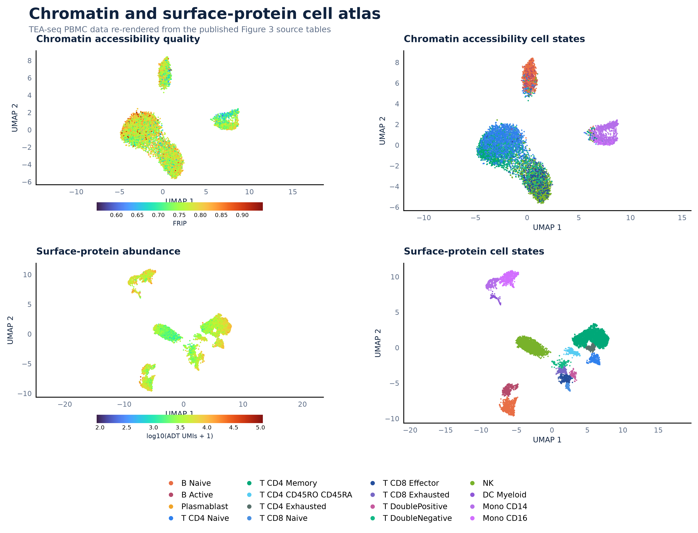
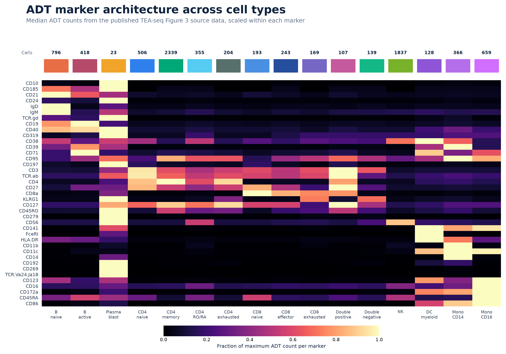

# ScholarFlow Skills

**Research workflows for the points where a plausible answer is not enough.**

Research work often becomes difficult after the experiment: the right journal is
unclear, author instructions are scattered, a figure is unreadable at real size,
or a polished paragraph quietly outruns the evidence. ScholarFlow Skills is
Zhoy's practical collection for turning those decisions into work a researcher
can inspect, revise, and use.

The collection has 16 public skills. Each public skill has one clear entry
point; Manuscript Studio keeps its specialist stages inside one coordinated
workflow rather than making them compete for the same request.

## Start With the Bottleneck

| When this is the problem | Use this skill | What it returns |
| --- | --- | --- |
| I have data but not a trustworthy analysis route. | [`bioinformatics-workbench`](skills/bioinformatics-workbench/) | A reproducible plan, QC gates, prerequisites, and realistic deliverables. |
| I do not know where my manuscript belongs. | [`journal-selection-advisor`](skills/journal-selection-advisor/) | A guided or advanced fit assessment, tiered candidates, constraints, and a submission sequence. |
| The target journal's rules are scattered across several pages. | [`journal-submission-normalizer`](skills/journal-submission-normalizer/) | A verified rule matrix, normalized files where possible, and a compliance report. |
| My scientific figure is finished but still does not communicate. | [`polish-sci-figures`](skills/polish-sci-figures/) | A readable figure package with final-size QA and source integrity. |
| I need to know whether the manuscript is actually defensible. | [`research-integrity-guardrail`](skills/research-integrity-guardrail/) | An evidence ledger and prioritized findings on claims, numbers, citations, and reproducibility. |

## Evidence, Writing, and Revision

| Need | Skill | What it is for |
| --- | --- | --- |
| Traceable academic discovery or citation verification | [`scholarflow-literature-search`](skills/scholarflow-literature-search/) | Reproducible searches, evidence screening, and documented coverage limits. |
| A recurring, reviewable literature brief | [`scholarflow-literature-monitor`](skills/scholarflow-literature-monitor/) | Source plans, screening rules, delivery cadence, and human review points. |
| A reference list or citation plan that can bear scrutiny | [`scholarflow-citation-review`](skills/scholarflow-citation-review/) | Citation verification, metadata checks, and evidence-to-claim review. |
| A full manuscript route from materials or a draft to final QA | [`scholarflow-manuscript-studio`](skills/scholarflow-manuscript-studio/) | Intake, evidence planning, drafting or revision, translation, formatting, and audit. |
| Raw notes that need to become a useful experimental record | [`scholarflow-experiment-log`](skills/scholarflow-experiment-log/) | Structured logs, metadata, anomalies, and follow-up actions. |
| A proposal that must make its case under evaluation | [`scholarflow-proposal-writer`](skills/scholarflow-proposal-writer/) | An evidence-aware proposal, evaluation package, and revision priorities. |
| Reviewer comments that must become a clear response package | [`scholarflow-review-response`](skills/scholarflow-review-response/) | Point-by-point responses, revision plans, and manuscript-change mapping. |

## Delivery and Verification

| Need | Skill | What it is for |
| --- | --- | --- |
| Files from different locations must work reliably before handoff | [`scholarflow-delivery-qa`](skills/scholarflow-delivery-qa/) | Safe staging, render checks, and final-delivery QA. |
| A Markdown report with Mermaid diagrams needs a clean PDF | [`scholarflow-report-pdf`](skills/scholarflow-report-pdf/) | Local report rendering with readable, verified pages. |
| A PDF needs both content and visual inspection | [`scholarflow-pdf-qa`](skills/scholarflow-pdf-qa/) | Page-level PDF review and verified output. |
| Research communication needs an editable presentation slide | [`scholarflow-research-slides`](skills/scholarflow-research-slides/) | An editable slide with a documented visual specification. |

## Install and Use

Copy the folder for the skill you need into your agent's skills directory, such
as `~/.codex/skills/` or `~/.claude/skills/`. Install
`scholarflow-manuscript-studio` as one folder; its internal `modules/` directory
is already included and must not be installed as separate skills.

Most skills work with ordinary web or browser access. Literature Search has an
optional local MCP server for Claude Code, documented in its
[setup notes](skills/scholarflow-literature-search/README.md); the browser-based
workflow remains available without it.

Start in plain language:

```text
Help me choose a realistic target journal for this abstract. My institution
requires an original research article and I need a JCR Q2 or better journal.

Normalize this manuscript for [journal]. Use current official author
instructions and give me a compliance report before changing the document.

Audit this manuscript for unsupported claims, mismatched numbers, citation gaps,
and reproducibility risks. Do not rewrite the prose until the evidence problems
are clear.
```

More guided examples are in [GETTING_STARTED.md](GETTING_STARTED.md), and the
complete inventory is in [SKILL_INDEX.md](SKILL_INDEX.md).

## What Good Looks Like

Public figure examples are not decorative mock data. The two images below are
source-data re-renders of eLife TEA-seq Figure 3, split into readable standalone
assets for online viewing.

<p align="center">
  
  
</p>

The provenance, licence, source-data links, and reproduction script are in the
[showcase package](showcase/elife-tea-seq-figure-3/).

## Product Principles

- **Evidence before polish.** Facts, citations, statistics, journal rules, and
  source data are never invented to make an output look complete.
- **Clear entry points.** New researchers receive structured guidance; advanced
  researchers can start directly from their manuscript, data, or constraints.
- **Visible uncertainty.** Unverified rules, incomplete data, and unsupported
  claims are reported rather than silently filled in.
- **One workflow, one router.** Internal stages do not compete as public skills.
- **Maintained scope.** Every public skill is checked before release against the
  repository's [quality standard](QUALITY_STANDARD.md).

## Licence

ScholarFlow workflow text and original implementation are released under the
[MIT License](LICENSE). External research articles, data sources, and software
remain subject to their own licences and access terms.
